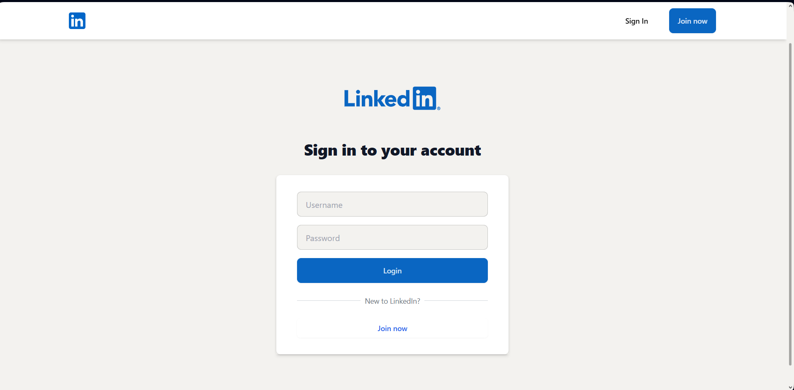
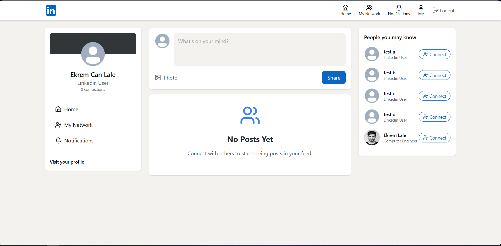
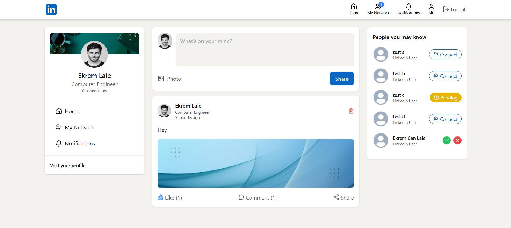
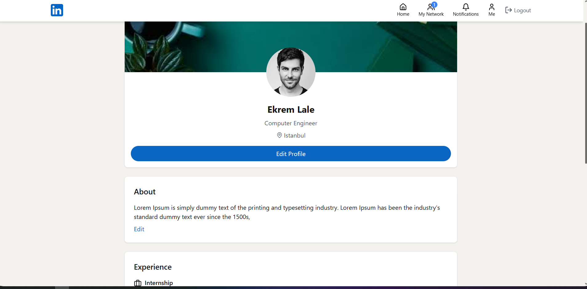
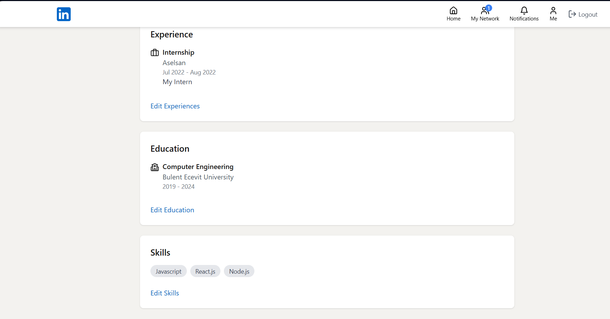

# 💼 LinkedinClone-App

**LinkedinClone-App** is a full-stack social networking platform inspired by LinkedIn, developed using the **MERN stack** (**MongoDB**, **Express**, **React**, **Node.js**) and enhanced with real-world features such as posting, liking, commenting, profile management, and connection status handling.

The backend is powered by **Node.js**, featuring **JWT-based authentication**, **Cloudinary** for media storage, and **Mailtrap** for testing email notifications. The frontend is built using **React** with **Tailwind CSS** for modern UI design, **lucide-react** icons for visual clarity, and **Axios** for seamless API communication.

This project reflects core professional social networking functionalities, providing a hands-on demonstration of scalable full-stack application development.


## 🚀 Features

- 🔐 **JWT-based user authentication** and route protection
- 📤 **Cloudinary-powered** media uploads for posts and profile pictures
- 📝 **Post creation**, editing, deletion, and feed display
- ❤️ **Like and comment system** on posts with real-time feedback
- 🔗 **Connection system**: send, accept, or reject connection requests
- 💬 Notification-ready structure using **Mailtrap**
- 👤 **User profile management**, including bio, photo, and activity
- 🧠 Modular architecture for easy scalability and maintenance
- 🎨 Fully responsive UI with **Tailwind CSS**
- ⚡ Optimized client-server communication using **Axios**

## 🛠️ Technologies Used

### Frontend
- **React**
- **Tailwind CSS**
- **Axios**
- **lucide-react**

### Backend
- **Node.js & Express**
- **MongoDB / Mongoose**
- **jsonwebtoken (JWT)**
- **Cloudinary SDK**
- **Mailtrap** – email testing and notifications

### Tools & Others
- **Postman** – API testing
- **VS Code** – Development
- **Git & GitHub** – Version control

## 📸 Screenshots







## ⚙️ Getting Started

### Prerequisites
- [Node.js & npm](https://nodejs.org/)
- [MongoDB](https://www.mongodb.com/)
- [Cloudinary account](https://cloudinary.com/)
- [Mailtrap account](https://mailtrap.io/)
- (Optional) Postman

## 🔧 Backend Setup

1. Clone the repository:
```bash
git clone https://github.com/EkremL/LinkedinClone-App.git
cd LinkedinClone-App
```

2. Navigate to the backend directory:
```bash
cd server
npm install
```

3. Create a `.env` file and add the following variables:
```env
PORT=5000
MONGO_URI=mongodb://localhost:27017/linkedinclone
JWT_SECRET=your_jwt_secret
NODE_ENV=development

# Cloudinary
CLOUDINARY_API_KEY=your_cloudinary_api_key
CLOUDINARY_API_SECRET=your_cloudinary_secret
CLOUDINARY_CLOUD_NAME=your_cloud_name

# Mailtrap
MAILTRAP_TOKEN=your_mailtrap_token
EMAIL_FROM=youremail@example.com
EMAIL_FROM_NAME=LinkedinClone App

# Frontend base URL
CLIENT_URL=http://localhost:5173
```

4. Start the backend server:
```bash
npm run dev
```

## 💻 Frontend Setup

1. Navigate to the client directory:
```bash
cd client
npm install
```

2. Run the frontend app:
```bash
npm run dev
```

> App will be available at: [http://localhost:5173](http://localhost:5173)

## 📁 Project Structure (Simplified)

```
LinkedinClone-App/
├── client/                 # React frontend
│   ├── src/
│   ├── public/
│   └── ...
├── server/                 # Node.js backend
│   ├── controllers/
│   ├── models/
│   ├── routes/
│   ├── middleware/
│   ├── utils/
│   └── index.js
```

## ✍️ Developer

**Ekrem Can Lale**

## 🤝 Contributing

Contributions, issues, and feature requests are welcome!
Feel free to fork the repository and submit a pull request.

## 📄 License

This project is open-source and available under the [MIT License](LICENSE).

